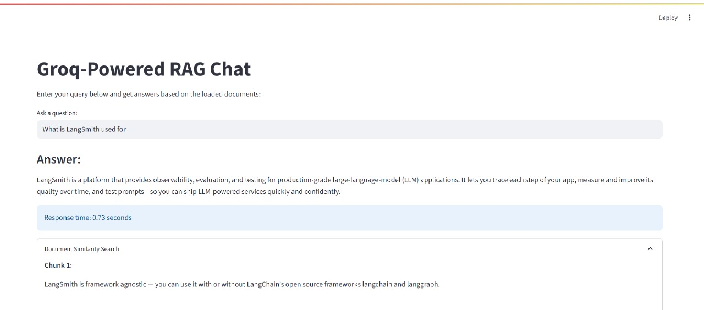
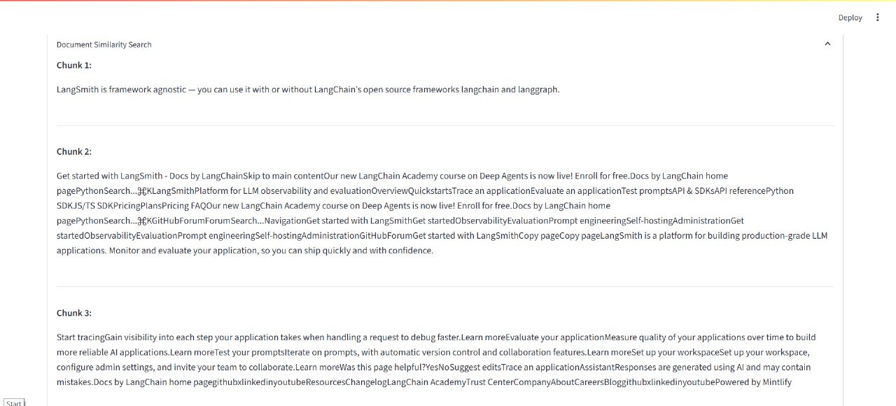

# RAG Project with GROQ

A **Retrieval-Augmented Generation (RAG)** system that fetches documents from a **Sanity.io GROQ** database and generates AI-powered answers using **OpenAI GPT-4**.

---

## Features
- Query Sanity.io database using GROQ.
- Retrieve relevant documents dynamically based on user input.
- Generate AI-powered answers with OpenAI GPT-4.
- Environment variable driven for secure API keys.

---

## Demo



## Installation

1. Clone the repository:
```bash
git clone https://github.com/kondurupriyanka/Rag_Groq_End_to_End_Project.git

2. Install Python dependencies:
```bash 
pip install -r requirements.txt

3. Create a .env file in the project root:
```bash
GROQ_API_KEY=your-groq-api-key

